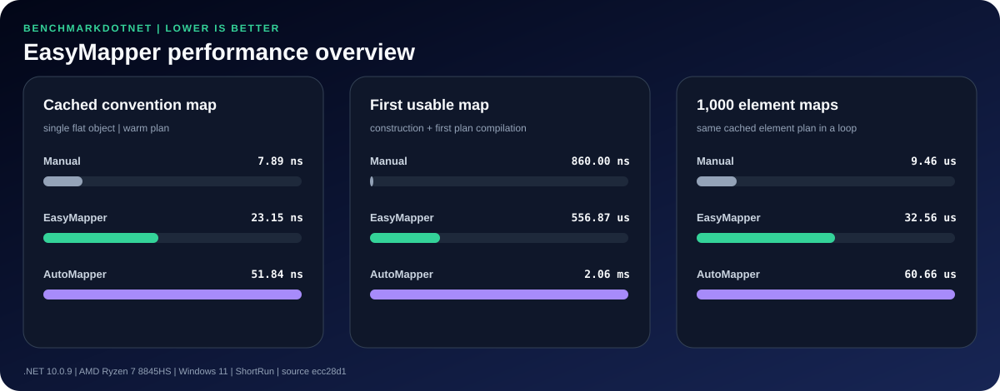

# EasyMapper

EasyMapper is a convention-first object mapper for .NET. Compatible properties map immediately;
strongly typed lambda rules are available only when conventions are not enough.

```csharp
UserDto dto = user.MapTo<UserDto>();
```

No profile, startup registration, dependency-injection container, or global configuration is
required. The first call builds and caches an expression-based mapping plan. Later calls execute
the compiled delegate directly.

> Public NuGet availability is being validated through the `staging` publishing pipeline. Stable
> releases remain gated by a version tag after beta verification.

## Supported targets

- .NET Standard 2.0 for broad library compatibility
- .NET 10 for the current LTS runtime and modern analysis

## Quick start

Install the package after the first public release:

```shell
dotnet add package Greenstone.EasyMapper
```

Map compatible properties by convention:

```csharp
using EasyMapper;

var user = new User
{
    Id = 17,
    Email = "ada@example.com"
};

UserDto dto = user.MapTo<UserDto>();
```

The explicit facade provides the same behavior:

```csharp
UserDto dto = EasyMapper.EasyMapper.Map<UserDto>(user);
```

When both compile-time types should be explicit:

```csharp
UserDto dto = EasyMapper.EasyMapper.Map<User, UserDto>(user);
```

Map into an existing destination:

```csharp
EasyMapper.EasyMapper.Map(user, existingDto);
```

## Configure only exceptions

Exclude sensitive properties:

```csharp
UserDto dto = EasyMapper.EasyMapper.Map<User, UserDto>(user, map => map
    .Except(destination => destination.PasswordHash));
```

Restrict a patch-style mapping to selected properties:

```csharp
EasyMapper.EasyMapper.Map(command, entity, map => map
    .Only(
        destination => destination.DisplayName,
        destination => destination.Email));
```

Map a calculated value:

```csharp
UserDto dto = EasyMapper.EasyMapper.Map<User, UserDto>(user, map => map
    .Bind(destination => destination.DisplayName)
    .From(source => source.FirstName + " " + source.LastName));
```

Use an explicit converter when the source and destination types differ:

```csharp
RecordDto dto = EasyMapper.EasyMapper.Map<ExternalRecord, RecordDto>(record, map => map
    .Bind(destination => destination.Id)
    .From(source => source.ExternalId, Guid.Parse));
```

## Application-wide conventions

Create and reuse a mapper when conventions differ from the safe defaults:

```csharp
IMapper mapper = new Mapper(new MapperOptions
{
    CaseSensitive = false,
    IgnoreNullValues = true,
    AllowScalarConversions = true
});
```

`Mapper` instances are thread-safe and may be registered as singletons. EasyMapper itself does not
depend on a particular dependency-injection package.

## Default behavior

- Public readable source properties participate in convention matching.
- Public writable destination properties may receive values.
- Indexers and read-only destination properties are ignored.
- Property names are case-sensitive by default.
- Assignable values are copied directly.
- Common scalar conversions, including numeric, enum, `Guid`, and `TimeSpan`, are enabled by default.
- Null values are assigned by default. `IgnoreNullValues` preserves an existing destination value.
- Destination classes require a public parameterless constructor when EasyMapper creates them.
- Mapping is shallow in the current preview; nested object and collection plans are roadmap items.

## Performance model

EasyMapper confines reflection to plan creation. A cached convention plan consists of:

1. A compiled destination factory.
2. A compiled assignment delegate.
3. A thread-safe cache entry keyed by source and destination type.

Call-specific `Only`, `Except`, and `Bind` rules intentionally produce isolated plans so one call
cannot modify another call's behavior.

### Reproducible benchmarks

The repository contains a BenchmarkDotNet suite that compares direct assignments, EasyMapper, and
AutoMapper across warmed convention mapping, first-map startup, inline lambda configuration,
existing destinations, and repeated element mapping. AutoMapper is a benchmark-only dependency and
is never included in the `Greenstone.EasyMapper` package.



The chart is generated from committed BenchmarkDotNet JSON rather than manually entered values.
See the [latest detailed results](docs/benchmark-results/README.md), including allocations,
environment metadata, and the current inline-configuration optimization target.

List or run the benchmarks locally:

```powershell
dotnet run --project benchmarks/EasyMapper.Benchmarks/EasyMapper.Benchmarks.csproj `
    --configuration Release -- --list flat

dotnet run --project benchmarks/EasyMapper.Benchmarks/EasyMapper.Benchmarks.csproj `
    --configuration Release -- --filter "*"
```

See the [benchmark methodology](docs/benchmarks.md) before comparing results. Scheduled GitHub runs
publish the complete BenchmarkDotNet reports as workflow artifacts; shared-runner timings are not
used as a pull-request quality gate.

## Quality gates

The repository treats warnings as errors and enables the current recommended .NET analyzers. The QA
pipeline performs:

1. Deterministic restore and Release build.
2. Formatting, code-style, and analyzer verification with warnings treated as errors.
3. Unit tests with a 99% line, branch, and method coverage threshold.
4. Public API smoke tests.
5. NuGet packing, including README, license metadata, XML documentation, and symbols.
6. Installation of the generated package into an isolated consumer application.
7. A one-million-operation sustained mapping test with a conservative throughput floor.

Run the same checks locally:

```powershell
./eng/qa.ps1
```

Skip only the sustained-load stage during a fast inner loop:

```powershell
./eng/qa.ps1 -SkipLoadTest
```

## Repository workflow

```text
contributor fork or feature/* -> development -> staging -> master
```

Contributor and feature pull requests target `development`. Only `development` may be promoted to
`staging`, where beta packages are validated and published. Only `staging` may be promoted to
`master`, which remains the stable source of record. GitHub branch protection and the required
promotion-policy workflow enforce this path.

See [CONTRIBUTING.md](CONTRIBUTING.md) for the complete contribution and promotion policy.

## Roadmap

- Nested-object and collection mapping
- Persistent reusable mapping definitions without mandatory profiles
- Constructor selection and immutable destination support
- Diagnostic mapping-plan inspection
- Native AOT/source-generated plans as an optional package
- `EasySimilarity` as an independent similarity-algorithm package
- A future `EasyMapper.Similarity` integration package

See [architecture](docs/architecture.md), [benchmark methodology](docs/benchmarks.md),
[sample application](samples/EasyMapper.Sample/Program.cs), and [changelog](CHANGELOG.md).

## License

EasyMapper is licensed under the MIT License.
